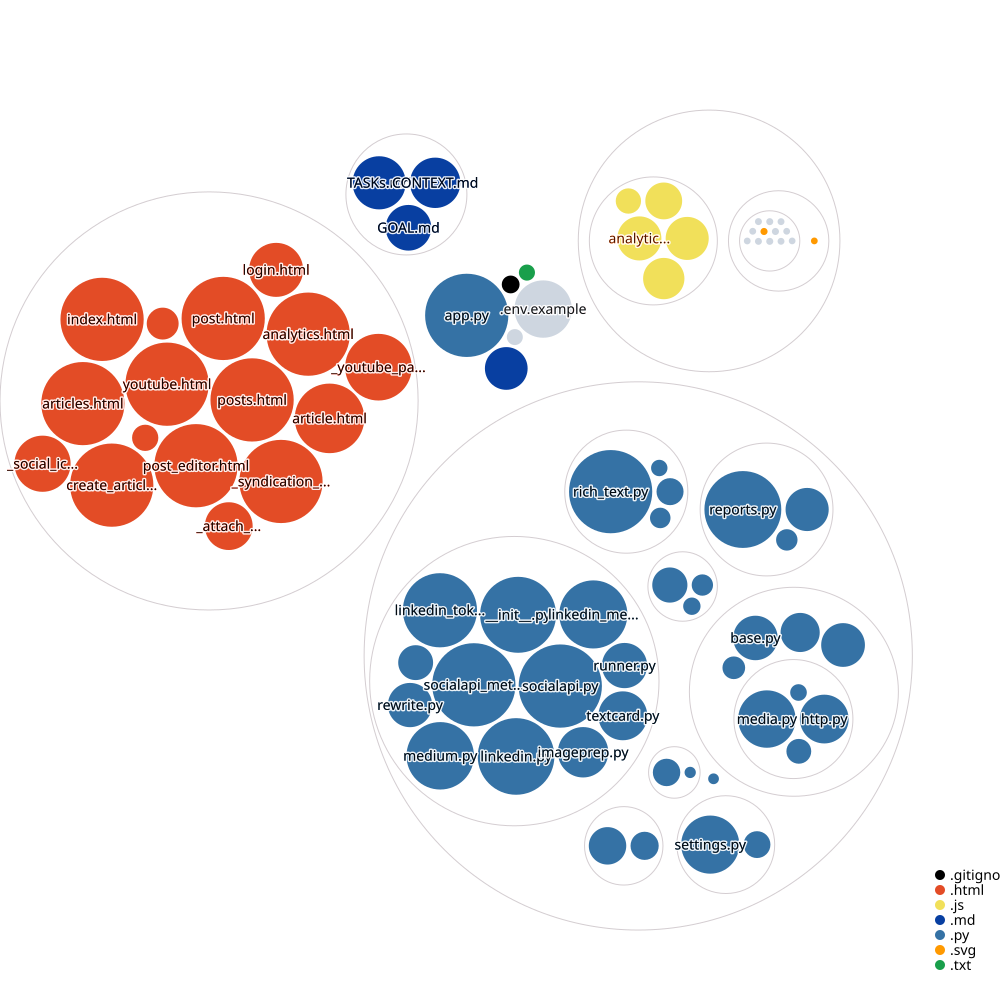

# Blog

A small, opinionated Flask blog with MongoDB storage (via MongoEngine),
multi-platform POSSE syndication (Medium / LinkedIn / X / Bluesky / Instagram /
Pinterest / Facebook), first-party analytics, and a Cloudflare tunnel for a
public URL.

---

## Screenshots

### Public site

| Feed | Post |
| --- | --- |
|  |  |

| Article | Sign in |
| --- | --- |
|  |  |

### Admin

| Post Manager | Articles |
| --- | --- |
|  |  |

| New post | New article |
| --- | --- |
|  |  |

| Edit post | Edit article |
| --- | --- |
|  |  |

| Analytics |
| --- |
|  |

---

## Repo visualization



---

## Requirements

- Python 3.9+
- MongoDB — MongoEngine needs a real `mongod` (the in-process `mongomock`
  fallback is **not** supported). Set `MONGO_URI` (e.g.
  `mongodb://localhost:27017/blog_db`), or leave it unset to use a local
  `mongod` at `mongodb://127.0.0.1:27017/blog_db`
  (`docker run -d -p 27017:27017 mongo`).
- [Cloudflared](https://developers.cloudflare.com/cloudflare-one/connections/connect-apps/)
  (optional — only needed for a public domain instead of `localhost`)

## Local setup

```bash
git clone <repo>
cd Blog
python -m venv .venv
# Linux / macOS:
source .venv/bin/activate
# Windows (cmd):
.venv\Scripts\activate
pip install -r requirements.txt

# 1) Create your env from the example and fill in the secrets:
cp .env.example .env

# 2) Collections + indexes are created automatically on first boot
#    (ensure_schema() in src/db/__init__.py) - no init script and no file seed.

# 3) Run the site:
python app.py          # -> http://localhost:5000
```

### Public URL via Cloudflare tunnel

The tunnel is defined by `~/.cloudflared/blog-config.yml` — a named `blog`
tunnel routing your domain to `http://127.0.0.1:5000`. It runs as the
auto-start `cloudflared` Windows service (so it comes up at boot):

```bash
cloudflared --config "%USERPROFILE%\.cloudflared\blog-config.yml" tunnel run blog
```

Then set `SITE_URL=https://<your-domain>` in `.env` so canonical links and
syndication use the public address.

## Admin

Log in at `/login` with `BLOG_ADMIN_USERNAME` / `BLOG_ADMIN_PASSWORD` from
`.env`. The admin area holds the Post Manager (`/posts`), Articles
(`/articles`), the post and article editors, and the analytics dashboard
(`/admin/analytics`).

## Analytics

First-party, no-third-party web analytics. Events are sent to `/api/analytics`
from `static/js/analytics.js` (via `navigator.sendBeacon` so they survive
navigation) and recorded server-side in `app.py`.

- Default store: `data/analytics.jsonl` (JSON Lines, one event per line).
- Set `ANALYTICS_STORE=mongo` to write events to the Mongo `analytics`
  collection instead — no code change needed.
- Admin dashboard: `/admin/analytics` (login required).
- **Geo-tracking (optional):** set `ANALYTICS_GEO=1` in `.env` to resolve each
  visitor's country / state from their IP at beacon time. Uses the free,
  no-key ip-api.com lookup, cached 24h per IP. The **raw IP is never stored** —
  only the salted `ip_hash` plus `country`/`region`/`city`. Behind the Cloudflare
  tunnel the real client IP is read from `CF-Connecting-IP` / `X-Forwarded-For`.
  Set `ANALYTICS_GEO=0` (default) to skip the lookups entirely.
